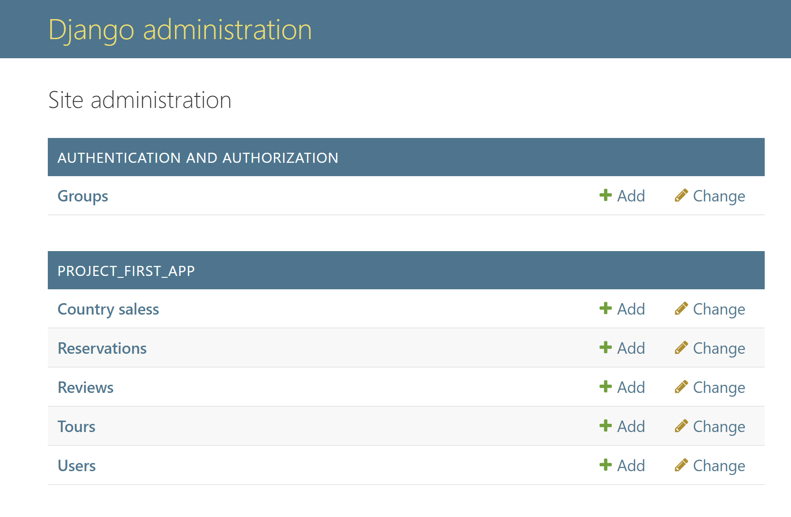

# Условие задания

**Список туров туристической фирмы**   

Хранится информация о названии тура, турагенстве, описании тура, периоде
проведения тура, условиях оплаты.
Необходимо реализовать следующий функционал:  

*  Регистрация новых пользователей.  

*  Просмотр и резервирование туров. Пользователь должен иметь возможность
редактирования и удаления своих резервирований.  

*  Написание отзывов к турам. При добавлении комментариев, должны
сохраняться даты тура, текст комментария, рейтинг (1-10), информация о
комментаторе.  

*  Администратор должен иметь возможность подтвердить резервирование
тура средствами Django-admin.  

*  В клиентской части должна формироваться таблица, отображающая все
проданные туры по странам.

# Создание моделей

На основе тз 4 варианта "Список туров туристической фирмы" я создала 5 моделей для пользователя, тура, резервирования, отзыва и страны.

## Модели

    class User(AbstractUser):
        date_of_birth = models.DateField(null=True, blank=True)
    
        groups = models.ManyToManyField(
            'auth.Group',
            related_name='custom_user_set',
            blank=True,
        )
        user_permissions = models.ManyToManyField(
            'auth.Permission',
            related_name='custom_user_permissions_set',
            blank=True,
        )
    
    
    class CountrySales(models.Model):
        country = models.CharField(max_length=100)
        total_sales = models.IntegerField(default=0)
    
        class Meta:
            unique_together = ('country',)
    
    
    class Tour(models.Model):
        title = models.CharField(max_length=255)
        agency = models.CharField(max_length=255)
        description = models.TextField()
        start_date = models.DateField()
        end_date = models.DateField()
        payment_terms = models.TextField(help_text="Условия оплаты")
        country = models.ForeignKey(CountrySales, on_delete=models.SET_NULL, null=True, blank=True)
    
    
    class Reservation(models.Model):
        user = models.ForeignKey(User, on_delete=models.CASCADE, related_name='reservations')
        tour = models.ForeignKey(Tour, on_delete=models.CASCADE, related_name='reservations')
        date_reserved = models.DateTimeField(auto_now_add=True)
        is_confirmed = models.BooleanField(default=False)
    
    
    class Review(models.Model):
        tour = models.ForeignKey(Tour, on_delete=models.CASCADE, related_name='reviews')
        user = models.ForeignKey(User, on_delete=models.CASCADE, related_name='reviews')
        comment = models.TextField()
        rating = models.IntegerField(choices=[(i, i) for i in range(1, 11)])
        date_added = models.DateTimeField(auto_now_add=True)
    

Также зарегистрировала в админ-панели все модели.

    admin.site.register(User)
    admin.site.register(Tour)
    admin.site.register(Review)
    admin.site.register(Reservation)
    admin.site.register(CountrySales)

