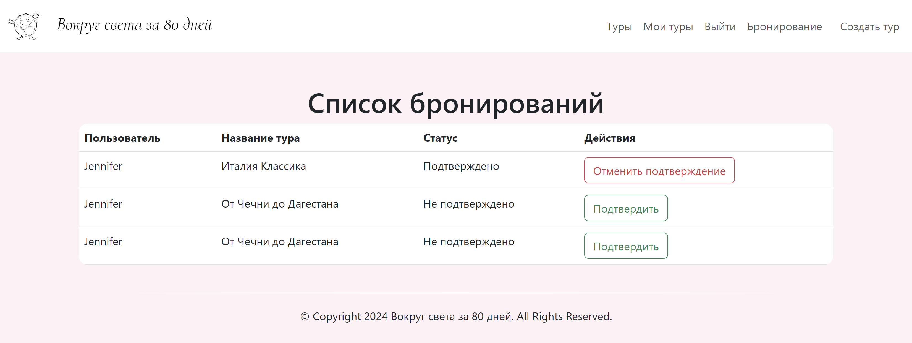

# Оформление сайта

Для того чтобы интерфейс суперпользователя, обычного авторизованного пользователя и неавторизованного пользователя различался и у админа было больше возможностей, прописала вот такое условие:  

    

        <ul class="navbar-nav ms-auto">
            <li class="nav-item">
                <a class="nav-link" href="">Туры</a>
            </li>

            
                <li class="nav-item">
                    <a class="nav-link" href="">Мои туры</a>
                </li>
                <li class="nav-item">
                    <a class="nav-link" href="">Выйти</a>
                </li>

                
                    <li class="nav-item">
                        <a class="nav-link" href="" style="margin-right: 10px;">Бронирование</a>
                    </li>
                    <li class="nav-item">
                        <a class="nav-link" href="/admin/" style="margin-right: 10px;">Создать тур</a>
                    </li>
                

            
                <li class="nav-item">
                    <a class="nav-link" href="">Регистрация</a>
                </li>
                <li class="nav-item">
                    <a class="nav-link" href="">Вход</a>
                </li>
            
        </ul>
    

Для списка туров ввела поиск по названию тура и турагенства, а также по примерным датам, в которые пользователь хочет отправиться в тур.

Пользователь может оставить отзыв и забронировать место на тур только один раз. Отзывы у тура с одинаковым названием, но проходящий в несколько дат подтягиваются со всех страничек этого тура.  

У админа есть возможность прям на сайте подтвердить или отклонить бронь. При нажатии на кнопку "Создать тур" админ переходит в Django-admin.  
