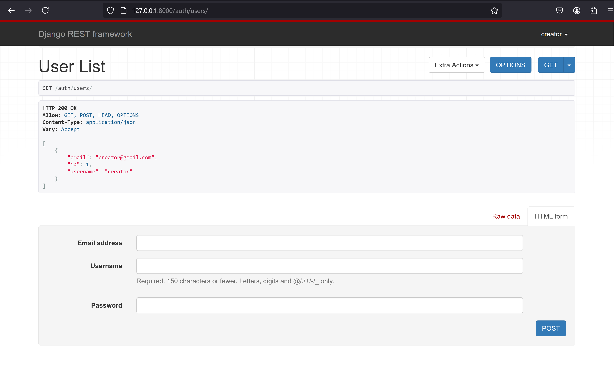
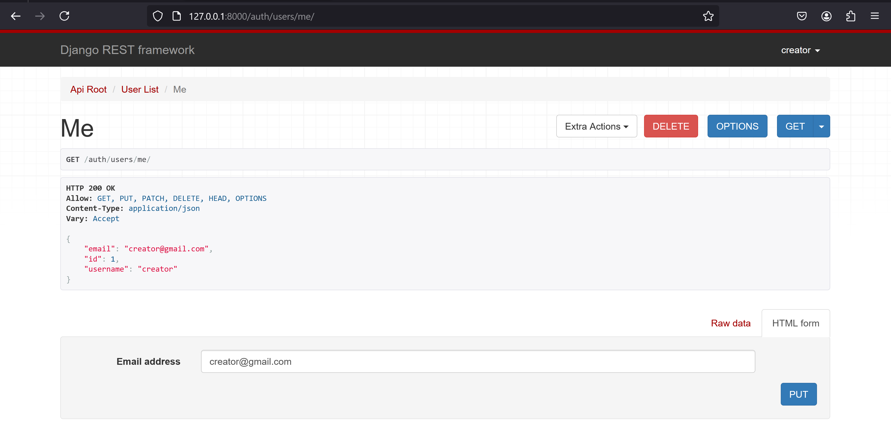
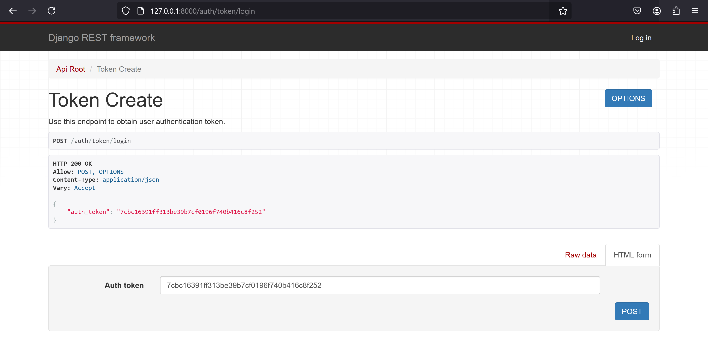

# Djoser  
Для реализации в settings.py добавила следующие словари: 

    REST_FRAMEWORK = {
        'DEFAULT_AUTHENTICATION_CLASSES': [
            'rest_framework.authentication.TokenAuthentication',
            'rest_framework.authentication.SessionAuthentication',
        ],
        'DEFAULT_PERMISSION_CLASSES': [
            'rest_framework.permissions.IsAuthenticated',
        ],
    }
    
    DJOSER = {
        'USER_ID_FIELD': 'id',
        'LOGIN_FIELD': 'username',
        'TOKEN_MODEL': 'rest_framework.authtoken.models.Token',
        'SERIALIZERS': {
            'current_user': 'djoser.serializers.UserSerializer',
            'user_create': 'djoser.serializers.UserCreateSerializer',
        },
    }
В bus_project\urls.py добавила следующие ссылки: 

    path("auth/", include("djoser.urls")),
        path("auth/", include("djoser.urls.authtoken")),
        path("api-auth/", include("rest_framework.urls")),

