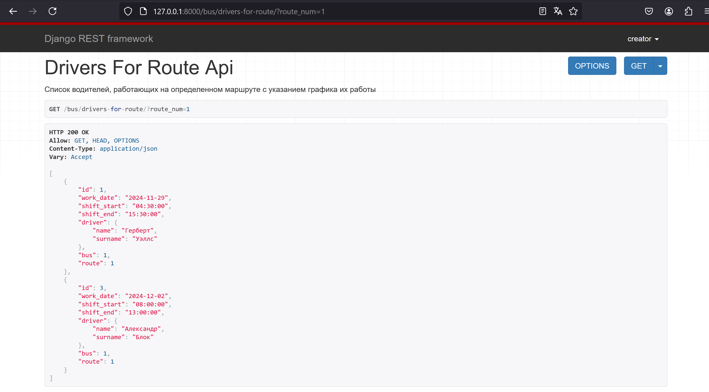
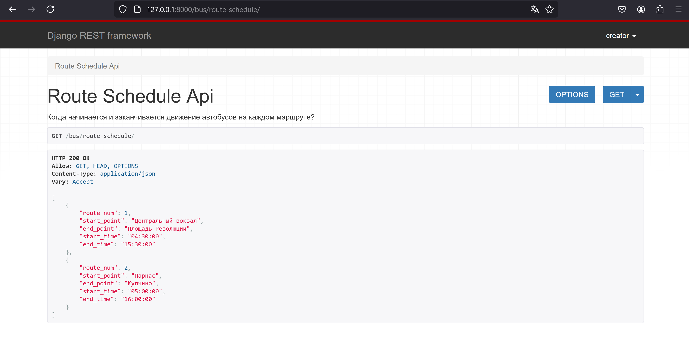
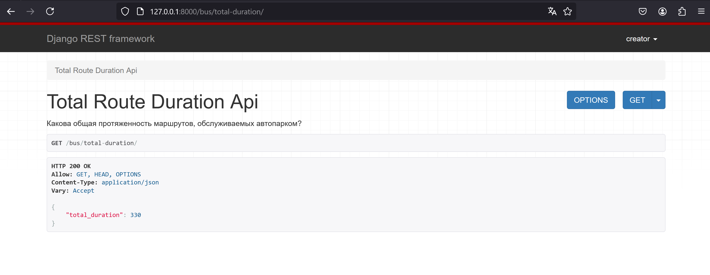
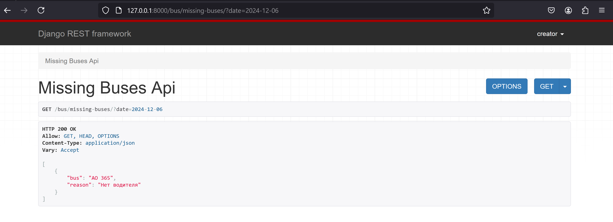
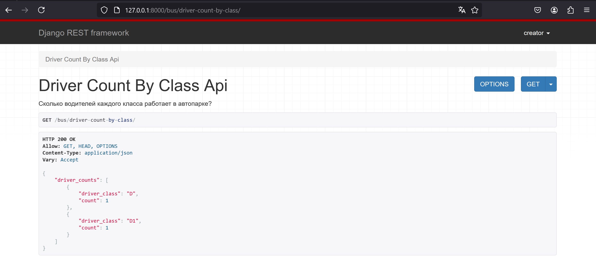

Диспетчеру автопарка могут потребоваться следующие сведения:  

1. Список водителей, работающих на определенном маршруте с указанием
графика их работы?

2. Когда начинается и заканчивается движение автобусов на каждом маршруте?  
  

3. Какова общая протяженность маршрутов, обслуживаемых автопарком?  
  

4. Какие автобусы не вышли на линию в заданный день и по какой причине
(неисправность, отсутствие водителя)?  
  

5. Сколько водителей каждого класса работает в автопарке? 
